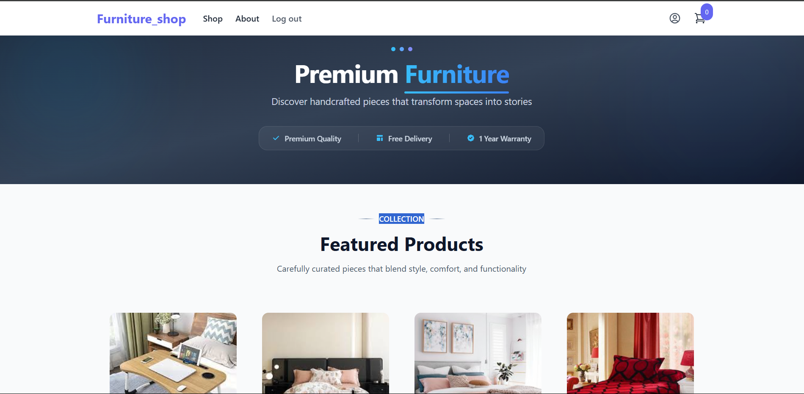
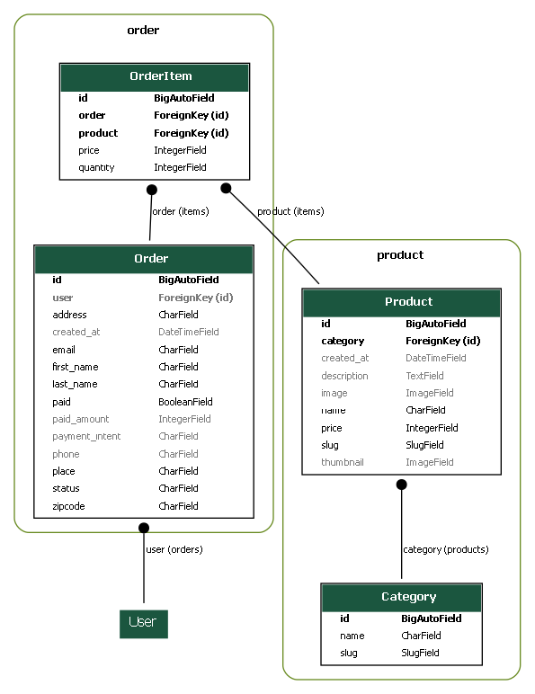

# Furniture Shop Ecommerce



A Django-based ecommerce web application for selling elegant, quality furniture with modern design and responsive interface.

## Features

- **Product Catalog** - Browse furniture by categories with search functionality
- **User Management** - Registration, login, and profile management
- **Shopping Cart** - Dynamic cart updates using HTMX
- **Responsive Design** - Mobile-friendly interface with Tailwind CSS
- **Admin Dashboard** - Full CRUD operations for products and categories
- **Order Management** - View order history and status tracking

## Tech Stack

**Backend:** Python 3.13.2, Django 5.2.1, SQLite  
**Frontend:** Tailwind CSS, HTMX, Django Templates  
**Additional:** Pillow (Image processing), Stripe (Payments)

## Models Diagram



## Installation

1. **Clone the repository**
   ```bash
   git clone https://github.com/itsmedarpan/django-ecommerce.git
   cd Furniture_shop
   ```

2. **Set up virtual environment**
   ```bash
   python -m venv venv
   source venv/bin/activate  # Linux/macOS
   # or venv\Scripts\activate  # Windows
   ```

3. **Install dependencies**
   ```bash
   pip install -r requirements.txt
   ```

4. **Configure environment**
   Create `.env` file:
   ```ini
   SECRET_KEY=your_django_secret_key
   DEBUG=True
   ```

5. **Set up database**
   ```bash
   python manage.py migrate
   python manage.py createsuperuser
   ```

6. **Run the server**
   ```bash
   python manage.py runserver
   ```

Visit `http://localhost:8000/` for the landing page and `http://localhost:8000/admin/` for admin panel.

## Usage

**Customer Features:**
- Browse and search products by category
- Add items to cart with dynamic updates
- Complete checkout and track orders
- Manage user profile and order history

**Admin Features:**
- Manage products, categories, and orders
- Process customer orders
- Automatic thumbnail generation for product images


## License

This project is licensed under the MIT License.

## Credits

Built following tutorials from [Code With Stein](https://www.youtube.com/@CodeWithStein). Thanks for the excellent Django ecommerce resources!
